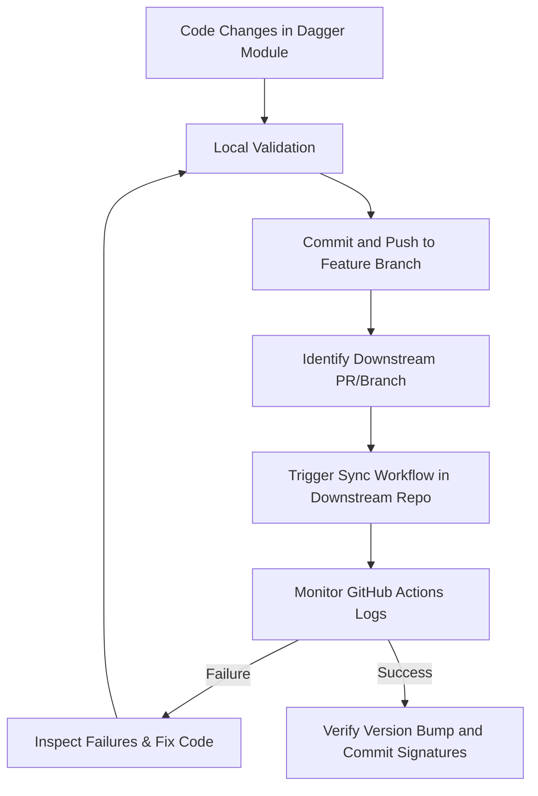

# Dagger Module Verification Loop Standard

This skill establishes the standard procedure for verification loops when updating, refactoring, or bug-fixing Dagger modules (such as `staydevops-ts`). Since Dagger modules are often executed dynamically from remote branches/tags in downstream repositories (e.g., `abhayraj-yadav-st4`), a structured verification loop is required to ensure correctness.

## The Verification Loop Flow



---

## 1. Local Validation

Before pushing any changes to the Dagger module repository, perform local syntax, type, and compilation checks to prevent trivial failures in CI.

- **NPM Package Build**: Ensure there are no TypeScript compilation or configuration errors.
  ```bash
  npm run build
  ```
- **Centralized Clean & Rebuild**:
  ```bash
  npm run clean && npm run build
  ```
- **Dagger Function Inspection**: Verify that the Dagger module functions are recognized and exportable without type conflicts.
  ```bash
  dagger functions
  ```

---

## 2. Commit and Push Changes

Once local validation passes, commit and push your fixes to your feature branch.

```bash
git add src/
git commit -m "fix(<scope>): <description of the fix>"
git push origin <feature-branch-name>
```

---

## 3. Trigger Downstream Workflows

To test how the Dagger module behaves when consumed by dependent repositories, trigger the corresponding PR workflow in the downstream repository.

### Identifying the Dependent Reference
Normally, dependent workflows run Dagger functions pointing to a specific branch or tag. For example:
```bash
dagger call -m github.com/StaytunedLLP/daggerverse@<feature-branch-name> <function-name> ...
```
Ensure the dependent branch references your active development branch (e.g., `feature/graphql-commit-verified-badge-3541890929037170221`).

### Triggering via Dummy Commit
Trigger the downstream GitHub Actions workflow by pushing a lightweight or empty commit in the dependent repository branch:
```bash
# In the downstream repository directory:
git checkout <downstream-pr-branch>
git commit --allow-empty -m "chore: trigger sync workflow for dagger module verification"
git push origin <downstream-pr-branch>
```

---

## 4. Monitor GitHub Actions Logs

Do not self-certify completion. Actively monitor the workflow runs of the downstream repository using the GitHub CLI (`gh`).

### List recent runs to find your run ID:
```bash
gh run list --repo StaytunedLLP/<dependent-repo> --branch <downstream-pr-branch> --limit 5
```

### View active run progress:
```bash
gh run view --repo StaytunedLLP/<dependent-repo> <run-id>
```

### Check failed logs dynamically:
```bash
gh run view --repo StaytunedLLP/<dependent-repo> <run-id> --log-failed
```

---

## 5. Failure Recovery Loops

If a downstream run fails:
1. **Analyze logs**: Determine which step failed (e.g., GraphQL validations, missing arguments, command injection, path issues).
2. **Re-apply fixes**: Apply edits to the source module repository.
3. **Re-commit & Push**: Push updated commits to the feature branch.
4. **Re-trigger**: Push another dummy commit to the downstream repository (or trigger via GitHub CLI `gh run rerun`).
5. **Re-verify**: Repeat until the workflow completes successfully.

---

## 6. Verification and Final Acceptance

A verification is successful only when:
- The downstream workflow run completes with a `success` conclusion.
- The version bump commits generated by the workflow are verified/signed by GitHub (i.e. possess the "Verified" badge under commits).
- You verify the commit signature status programmatically:
  ```bash
  gh api repos/StaytunedLLP/<dependent-repo>/commits/<commit-sha> --jq '.commit.verification'
  ```
